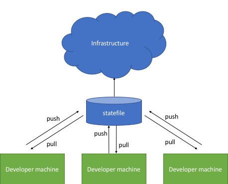

# Remote States
By default, Terraform stores state locally in a file named `terraform.tfstate`. Because this file must exist, it makes working with Terraform in a team complicated since it is a frequent source of merge conflicts. Remote state helps alleviate these issues.

With remote state, Terraform stores the state in a remote store. Terraform supports storing state in Terraform Enterprise, Consul, S3, and more. In this repo we will prefer S3. You should ** Never ** store a state file in your git repo, as Terraform often keeps sensitive information in the state file. S3 allows us to store it in a centrally accessible place that only our team has access to. For added security we can enable encryption to keep our data safe at rest, and we can enable versioning so that we can roll back in case something goes wrong. 

Storing a state file in a remote backend also enables collaboration, and for us that is critical as we work with distributed teams. Below is an example what I mean:

In this example, each developer is able to apply changes that are saved back to the Terraform statefile, which is stored in what is a called a "remote backend". This is similar to the way we use a repository like GitHub to make collaboration easier. 

In order to use a remote state file, you will need to configure the Terraform Backend. 

## Backends
A "backend" in Terraform determines how state is loaded and how an operation such as apply is executed.

By default, Terraform uses the "local" backend, which is the normal behavior of Terraform you're used to. 

Setting up a remote backend can either be done by passing in parameters to the terraform CLI, or by adding a terraform cofiguration block in your code.
More information on configuring a S3 backend for Terraform is found here: https://www.terraform.io/docs/backends/types/s3.html
